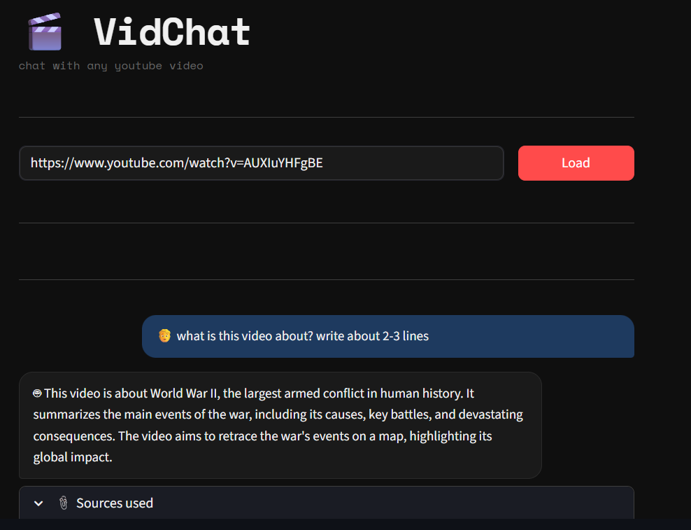
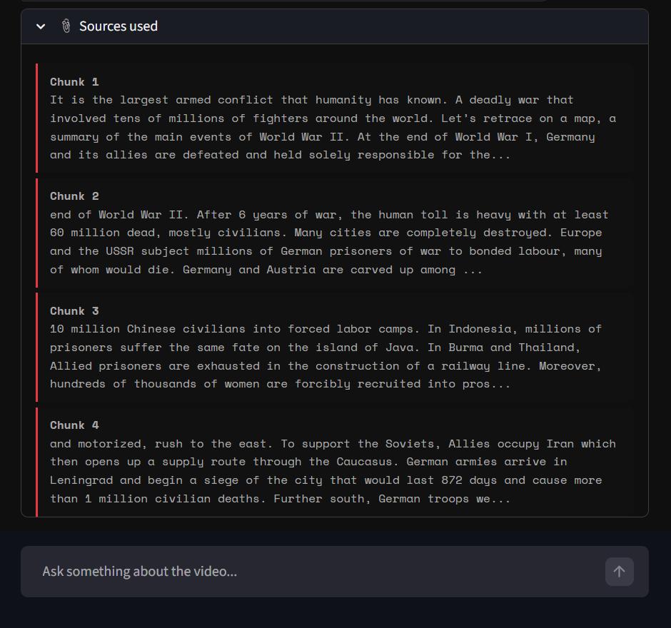
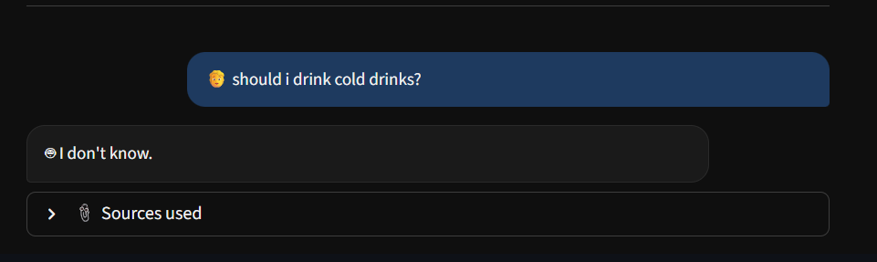

# 🎬 VidChat — Chat with any YouTube Video

VidChat is a RAG (Retrieval-Augmented Generation) powered web app that lets you have a conversation with any YouTube video. Paste a URL, and ask anything about the video's content.

Built with LangChain, FAISS, Groq (LLaMA 3.3 70B), and Streamlit.

---

## 🚀 Demo





> Paste a YouTube URL → Ask questions → Get answers grounded in the video transcript

---

## 🧠 How it works

1. **Transcript Fetching** — Fetches the English transcript of the YouTube video using `youtube-transcript-api`
2. **Chunking** — Splits the transcript into overlapping chunks using LangChain's `RecursiveCharacterTextSplitter`
3. **Embedding** — Converts each chunk into a semantic vector using `sentence-transformers/all-MiniLM-L6-v2`
4. **Vector Store** — Stores all vectors in a FAISS index for fast similarity search
5. **Retrieval** — When you ask a question, the top 4 most relevant chunks are retrieved
6. **Generation** — The retrieved chunks + your question are sent to LLaMA 3.3 70B (via Groq) to generate a grounded answer

---

## 🛠️ Tech Stack

| Tool | Purpose |
|------|---------|
| Streamlit | Web UI |
| LangChain | RAG orchestration |
| FAISS | Vector similarity search |
| Groq (LLaMA 3.3 70B) | LLM for answer generation |
| sentence-transformers | Text embeddings |
| youtube-transcript-api | Transcript fetching |

---

## ⚙️ Setup & Installation

### 1. Clone the repo
```bash
git clone https://github.com/kforkandarp/Yt-rag-project
cd YOURREPONAME
```

### 2. Create and activate a virtual environment
```bash
python -m venv venv

# Windows
venv\Scripts\activate

# Mac/Linux
source venv/bin/activate
```

### 3. Install dependencies
```bash
pip install streamlit langchain langchain-text-splitters langchain-huggingface langchain-community langchain-groq faiss-cpu sentence-transformers youtube-transcript-api python-dotenv
```

### 4. Get a Groq API key
- Sign up at [console.groq.com](https://console.groq.com)
- Go to **API Keys** → **Create API Key**
- Copy the key

### 5. Create a `.env` file
Create a file called `.env` in the project root:
```
GROQ_API_KEY=your_actual_key_here
```

### 6. Handle YouTube IP blocks (if needed)
If YouTube blocks transcript fetching (common on cloud IPs):
1. Install the **"Get cookies.txt LOCALLY"** browser extension
2. Go to [youtube.com](https://youtube.com) while logged in
3. Export cookies → save as `cookies.txt` in the project folder

### 7. Run the app
```bash
streamlit run app.py
```
The app will open automatically at `http://localhost:8501`

---

## 📁 Project Structure

```
vidchat/
├── app.py          # Main Streamlit application
├── .env            # Your API keys (never committed to Git)
├── .gitignore      # Ignores .env, venv, cookies.txt etc.
└── cookies.txt     # YouTube cookies (never committed to Git)
```

---

## ⚠️ Known Limitations

- Only works with YouTube videos that have English captions enabled
- Answer quality depends on transcript accuracy (auto-generated captions can have errors)
- Free Groq tier has rate limits

---

## 📄 License

MIT License — feel free to use, modify, and share.
